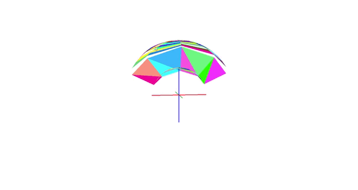

# Elliptical Inverted Truncated Cone

This project is a C++ implementation of an inverted truncated cone with elliptical bases, created using the **Qt framework** and rendered with **OpenGL**.

## Features

- **Elliptical Bases**: The cone has two elliptical bases, with the option to customize the dimensions and orientation.
- **OpenGL Rendering**: The project uses OpenGL for rendering the 3D cone, ensuring high performance and smooth rendering of graphics.
- **Qt Integration**: The application utilizes the Qt framework for managing the graphical user interface (GUI) and handling user interactions.
- **Customizable Parameters**: You can adjust parameters like the dimensions of the ellipses, the height of the cone, and the level of detail in the mesh.

## Technologies Used

- **C++**: Core logic and computations.
- **Qt**: GUI management and event handling.
- **OpenGL**: 3D rendering and visualization.

## Getting Started

### Prerequisites

To run this project, you need:

- A C++ compiler (GCC, Clang, or MSVC)
- Qt framework (4.14.2+)
- OpenGL libraries (version 3.3 or higher)
